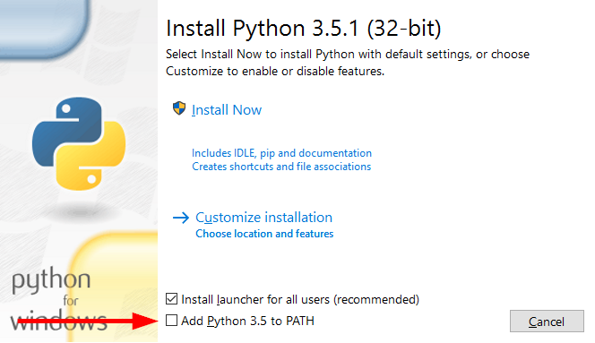

# Running the script

This guide is for people running Windows 7 and above. If you're using Mac: uh, I can't help you there, but you should be able to roughly follow the guide like a person on Windows. If you're using Linux, you should be knowledgable enough to figure out what you need to do from the gist of the guide.

The gist of the guide is:

1. Install Python 3.5 (yes, specifically 3.5 and above), making sure to "Add Python 3.5 to your PATH"
2. Get the script.
3. Using `pip`, install `flask` and `requests`
4. Run the script.

## 1. Installing Python 3.5

Head over to the [Python downloads webpage](https://www.python.org/downloads/) and dowload Python 3.5 or above. Don't download a Python which starts with 2. Run the installer.

Once you're here, be careful! Be sure to tick the "Add Python 3.5 to your PATH" box:



## 2. Get the script

Download a zip file of the script [here](archive/master.zip). If that doesn't work, you should be able to find a "Download ZIP" button on the front page of the repository.

Unzip it somewhere where you can find, and open it up. You should be able to see "timetabler.py" in the folder.

## 3. Installing `flask` and `requests`

Now, shift-right-click on the folder. Click on "Open command window here."

You should now see a `cmd` window. In the window, type this in:

```
pip install flask requests
```

and press enter. It should download and install all the things it needs. When it says "Successfully installed…", continue onto the next step.

## 4. Running the script

**BEWARE**: don't type your username and password anywhere! I may be stealing your login credentials! You have to trust me that I'm not going to steal your info, or you can take a look at the source as it's just in Python. If you can't do either of these, you probably shouldn't use this script.

Still inside the command window, type this in:

```
python timetabler.py USERNAME PASSWORD
```

replacing USERNAME and PASSWORD with your Allocate+ username and password respectively. Press enter. This is what should pop up:

```
Logging into Allocate+
Grabbing activities for subjects
Finding all timetables without clashes from a lot of timetables
Sorting all permutations
Generating colour palette
 * Running on http://127.0.0.1:5000/ (Press CTRL+C to quit)
```

Once it is running, go to 127.0.0.1:5000 in a web browser and check out your timetables. You can use your arrow keys to navigate too.

If you'd like to change how the timetables are sorted, take a look at `sorting.py`. It should have all the information needed for you to make your own sorting algorithm.

## Running the script again

If your classes have changed, for example, because it's another semester, be sure to delete `all_acts.json` from the timetabling folder. That file stores your activities so it doesn't have to retrieve them from Allocate+ again.

When running the script again, all you need to do is open a command window and run the last command.
